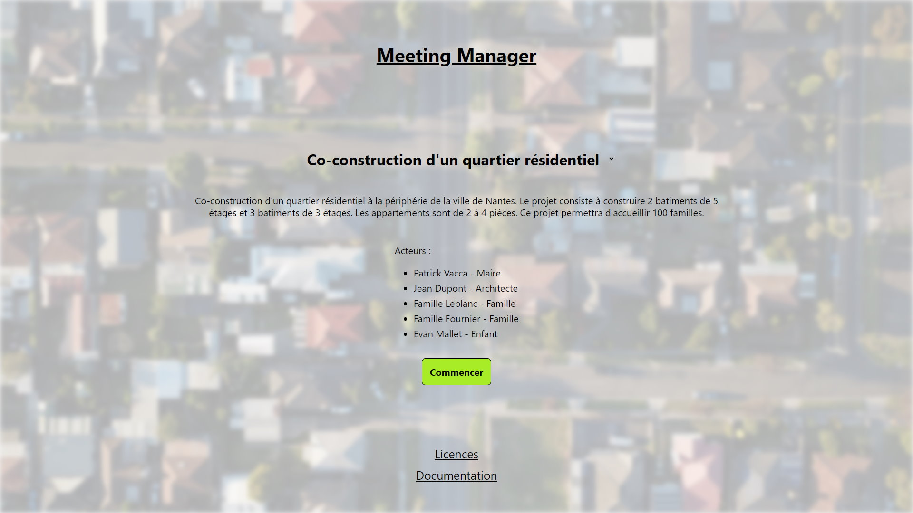
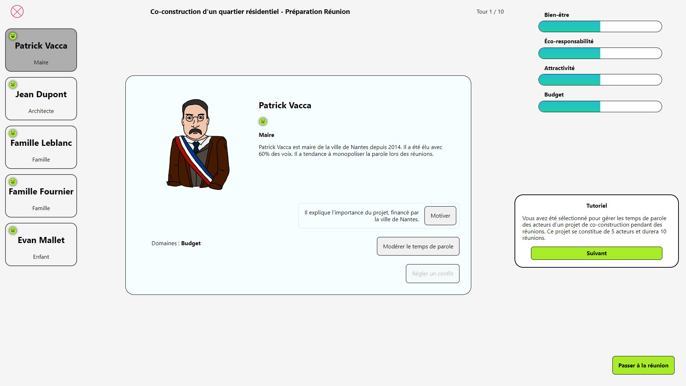
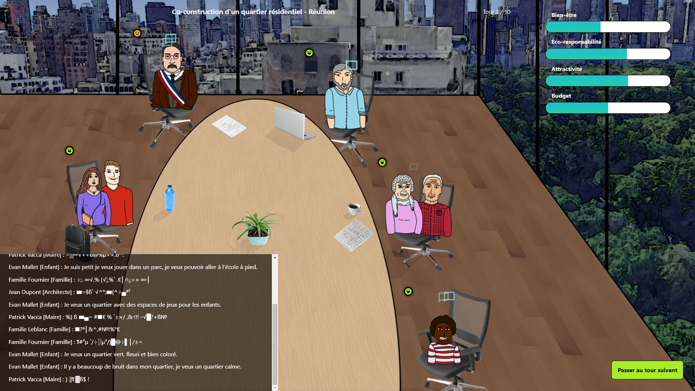
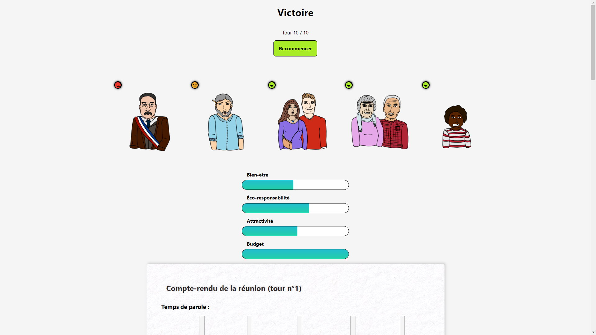

# MeetingManager

Participants :

- [Théo LUDWIG](https://github.com/Divlo)
- [Nathan MEHL](https://github.com/Mehln)
- [Axel MUNCH](https://github.com/axelmunch)

## Description du jeu

Jeu sérieux sur le thème de la co-construction.

Voir [DESCRIPTION.md](./DESCRIPTION.md) pour plus d'informations.

## Type de jeu et mécanismes d'apprentissage

Type de jeu : **Gestion**

Le joueur va jouer un certain nombre de tours autour d'un sujet qui implique la co-construction (Construction d'un quartier résidentiel ou Développement d'une application).

- Faire découvrir au joueur les enjeux organisationnels des acteurs :
  - Gestion du temps de parole
  - Conflits
  - Satisfaction des acteurs
  - Hiérarchie
- Apprentissage par essai-erreur

## Lien du jeu

[meeting-manager.axelmunch.fr](https://meeting-manager.axelmunch.fr)

## Captures d'écran









## Procédures d'installation et d'exécution

### Prérequis

- [Node.js](https://nodejs.org) >= 16.0.0
- [npm](https://npmjs.com) >= 8.0.0

### Installation

```sh
# Clone the repository
git clone https://github.com/axelmunch/meeting-manager.git

# Go to the project root
cd meeting-manager

# Install dependencies
npm install

# Run web server
npm run dev
```

### Distribution

```sh
# Build website
npm run build

# Export website
npx next export

# Go to the output directory
cd out

# Run web server (optional)
npx serve
```
